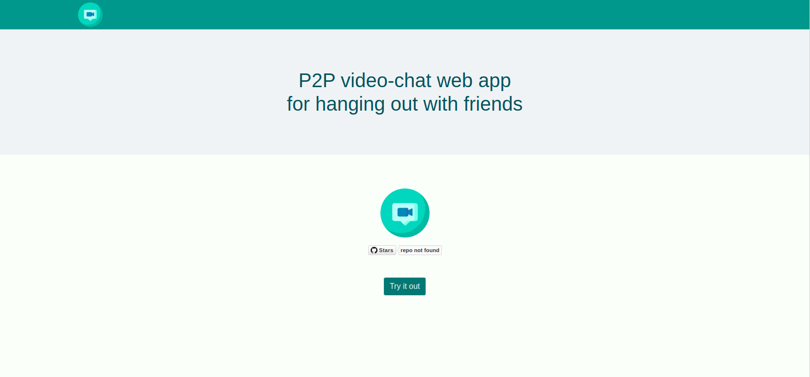

# chillout


# Screenshots

<kbd></kbd><br/>


# Quickstart

## 1. Install deps
  ```
  npm install
  ```
## 2. Start backend server
  ```
  node server.js
  ```
## 3. Start peerjs server (signaling)
  ```
  docker run -p 9000:9000 -d peerjs/peerjs-server
  ```
## 4. Start hot-reload dev server
  ```
  npm run serve
  ```

# Other cmds

## Compiles and minifies for production
```
npm run build
```

## Run your tests
```
npm run test
```

## Lints and fixes files
```
npm run lint
```
